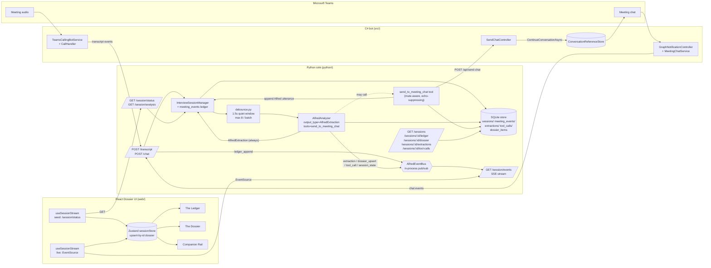

# ALFRED.md

This file is the fastest way for an LLM to become operationally useful in this
repo. It describes the current Alfred system as implemented on
`feat/alfred-chat-modality`.

Read this before editing code.

## 1. Product definition

Alfred is a Microsoft Teams meeting assistant. His job is **intent alignment**:
leave the room with a shared understanding of what was decided, what is still
open, who does what, and what could go wrong.

Product behavior:

1. Alfred joins a Teams meeting.
2. Live audio is transcribed with speaker-aware metadata when available.
3. Meeting chat is ingested live.
4. Speech and chat are merged into one append-only meeting ledger.
5. On each trigger event, the agent produces:
   - exactly one structured `AlfredExtraction` (his rolling intelligence:
     running summary, topics, notes, **decisions**, **open questions**,
     **action items**, **risks**), and
   - zero or more tool calls. Today the only tool is
     `send_to_meeting_chat`.
6. When the agent calls `send_to_meeting_chat`, the message is posted into
   the meeting chat via the C# bot and Alfred's utterance is appended back
   into the shared ledger.
7. Humans in the meeting chat speak to Alfred by just chatting; their
   messages are ingested and become agent input.

Silence is the default — if the agent does not call the tool, Alfred stays
quiet. There is no `SILENT / SEND / ASK` enum anymore. Thinking and acting
are separate concerns.

## 2. Current truth

- The canonical runtime state lives in the Python sink.
- The canonical meeting history is `InterviewSession.meeting_events`.
- Inbound meeting chat has one authoritative path in normal operation:
  Microsoft Graph notifications.
- Bot Framework is used for two things:
  (a) capturing `ConversationReference` values so Alfred can send proactive
      chat messages back into the meeting, and
  (b) optionally forwarding inbound chat when Graph ingress is not
      configured.
- The agent contract is `AlfredExtraction` (structured output) + tool
  calls. It is **not** an action enum.
- The send path is the `send_to_meeting_chat` agent tool. The old
  `teams_chat` output route is deleted.
- Persistence is SQLite. Five tables: `sessions`, `meeting_events`,
  `extractions`, `tool_calls`, `dossier_items`.
- The primary UI is a React + Vite + Tailwind v4 app in `web/`.
  `python/streamlit_ui.py` still exists as a debug observer and is not the
  product surface.
- The UI is read-only with respect to the meeting. Only Alfred speaks into
  the meeting chat, and he does so via the agent tool.
- Final speech turns and human chat messages both trigger agent analysis.

## 3. Architecture

Four runtime pieces.

### 3.1 C# Teams transport

Location: `src/`

- Joins Teams meetings with the Graph Communications SDK.
- Receives Teams media.
- Streams audio to the configured STT provider.
- Captures Teams meeting chat via Graph change notifications.
- Captures `ConversationReference` values from Bot Framework activities.
- Sends Alfred chat messages proactively through Bot Framework.
- Forwards transcript and chat events to the Python sink.

Key files:

- `src/Program.cs`
- `src/Services/TeamsCallingBotService.cs`
- `src/Services/CallHandler.cs`
- `src/Services/MeetingChatService.cs`
- `src/Services/GraphApiClient.cs`
- `src/Services/GraphNotificationProcessor.cs`
- `src/Services/GraphNotificationCrypto.cs`
- `src/Services/GraphValidationTokenValidator.cs`
- `src/Services/AlfredBot.cs`
- `src/Controllers/GraphNotificationController.cs`
- `src/Controllers/SendChatController.cs`
- `src/Services/PythonTranscriptPublisher.cs`
- `src/Services/PythonChatPublisher.cs`

### 3.2 Python sink

Location: `python/`

- Owns the active meeting session state.
- Normalizes transcript and chat into one append-only ledger.
- Builds Alfred agent context.
- Runs the live-turn analyzer.
- Applies `AlfredExtraction` deltas to the session's rolling state.
- Exposes the `send_to_meeting_chat` agent tool.
- Persists session artifacts to SQLite and to per-session JSON.
- Serves history endpoints used by the React UI.

Key files:

- `python/transcript_sink.py`
- `python/meeting_agent/models.py`
- `python/meeting_agent/session.py`
- `python/meeting_agent/agent.py`
- `python/meeting_agent/tools.py`
- `python/meeting_agent/output.py`
- `python/meeting_agent/persistence.py`
- `python/variants/alfred.py`
- `python/legionmeet_platform/specs/alfred.yaml`

### 3.3 React Dossier UI

Location: `web/`

Vite + React 19 + TypeScript + Tailwind v4 + Zustand. **Server-Sent
Events drive all live state.** On mount, a one-shot `GET /session/status`
seeds the store; from then on, the UI consumes `GET /session/events` and
the store handles each event type (ledger_append, extraction,
dossier_upsert, tool_call, session_state, session_started/ended).
Components never poll.

Three columns:

- **The Ledger** — live append-only meeting record.
- **The Dossier** — Alfred's intent-alignment extraction (decisions /
  open questions / action items / risks), the hero column.
- **The Companion Rail** — running summary, topics, session controls
  (start / mute / end). **Not** a chat composer; the UI cannot speak
  for Alfred or a human.

Key files:

- `web/src/App.tsx`
- `web/src/components/{Header,Ledger,LedgerEntry,Dossier,DossierCards,CompanionRail,StatusBadge}.tsx`
- `web/src/lib/{sink,types,format}.ts`
- `web/src/stores/sessionStore.ts`
- `web/src/hooks/useSessionStream.ts`

### 3.4 Streamlit debug observer (legacy)

Location: `python/streamlit_ui.py`

Still runs. Useful for poking the sink's state. Not the product UI.

## 4. End-to-end flows

### 4.1 Speech flow

1. `TeamsCallingBotService` joins the meeting and creates the media session.
2. `CallHandler` receives audio buffers.
3. Audio streams to the configured realtime transcriber.
4. Transcript events POST to the Python sink at `/transcript`.
5. The sink stores compatibility events and appends normalized
   `MeetingEvent(kind="speech")` items into `meeting_events`. The event is
   persisted to SQLite (`meeting_events` table).
6. Final speech turns are queued for Alfred analysis.

### 4.2 Inbound meeting chat flow

1. `MeetingChatService` tracks active meeting chat thread ids from live calls.
2. It creates and renews Graph subscriptions.
3. Microsoft Graph POSTs notifications to
   `src/Controllers/GraphNotificationController.cs`.
4. `GraphNotificationProcessor` validates the batch, handles lifecycle
   events, decrypts resource data, and resolves/fetches messages.
5. Valid chat messages translate to `ChatEventPayload`.
6. `PythonChatPublisher` POSTs them to the sink at `/chat`.
7. The sink appends normalized `MeetingEvent(kind="chat")` items and
   persists them. Human chat messages are queued for Alfred analysis.

### 4.3 Outbound Alfred chat flow (tool-driven)

1. Alfred analysis runs on a trigger event (speech or human chat).
2. The agent produces an `AlfredExtraction`. It may additionally call
   `send_to_meeting_chat(text, kind, reply_to_message_id?)`.
3. The tool:
   - refuses if `session.alfred_muted` or the session is missing a
     cached `conversation_reference_id`;
   - auto-suffixes `?` when `kind == "question"` and missing;
   - records an `OutboundChatIntent` for bot-echo suppression **before**
     posting;
   - POSTs to the C# bot at `BOT_SEND_CHAT_URL`
     (`src/Controllers/SendChatController.cs`) when configured; otherwise
     logs a dry-run;
   - appends an Alfred-sourced `MeetingEvent(kind="chat", from_bot=True,
     source="alfred")` into the ledger so the next tick sees it;
   - returns a `SendResult` to the LLM so failures flow back into context.
4. `SendChatController` resolves the cached `ConversationReference`,
   rate-gates per thread, deduplicates within a 20 s window, and sends
   through `CloudAdapter.ContinueConversationAsync`.
5. Echo suppression in the sink prevents Alfred from re-triggering on
   his own message.

### 4.4 Bot Framework role

`AlfredBot` remains responsible for capturing and refreshing
`ConversationReference` values per meeting chat thread, and optionally
forwarding inbound chat when Graph ingress is not configured. It is not
an authoritative ingestion path when Graph is configured.

## 5. Canonical state model

The key state object is `InterviewSession` in
`python/meeting_agent/models.py`.

Important fields:

- `meeting_events` — canonical append-only ledger (source of truth).
- `transcript_events`, `chat_messages` — raw compatibility views.
- `conversation_reference_id`, `graph_chat_thread_id` — outbound send.
- `prompt_cache_key`, `latest_response_id`, `latest_agent_cursor` —
  prompt-cache and continuation.
- `running_summary`, `topics`, `notes` — rolling narrative state.
- `decisions`, `open_questions`, `action_items`, `risks` — rolling
  intent-alignment state (merged by `id` from each extraction).
- `alfred_muted`, `outbound_chat_intents` — send governance.

### 5.1 MeetingEvent

Normalized unit Alfred reasons over.

- kinds: `speech`, `chat`, `system`
- sources: `teams_media`, `graph_notification`, `bot_framework`,
  `alfred`, `system`

Invariant: if a new user-visible event matters to Alfred, it becomes a
`MeetingEvent`. Alfred's own outbound messages are ledger entries with
`source="alfred"` and `from_bot=True`.

### 5.2 Intent-alignment types

```
Decision      { id, text, committed_by[], status: tentative|committed|superseded, ... }
OpenQuestion  { id, text, raised_by, answer?, status: open|answered|deferred, ... }
ActionItem    { id, text, owner, due, status: proposed|owned|done, ... }
Risk          { id, text, severity: low|medium|high, ... }
```

Each carries `first_seen_at`, `confidence`, and `source_event_ids[]`
pointing back into `meeting_events`, so the UI can (and will) jump from
a dossier card to the ledger turns that produced it.

## 6. Agent contract

The live-turn analyzer emits `AlfredExtraction`:

```
rationale        — one-line justification of this tick
running_summary  — full replace, markdown, <= ~150 words
topics           — full replace, running list
notes            — delta this tick
decisions        — delta this tick (merged by id into session)
open_questions   — delta this tick
action_items     — delta this tick
risks            — delta this tick
```

The agent additionally has access to one tool:

```
send_to_meeting_chat(text, kind="statement"|"question", reply_to_message_id?) -> SendResult
```

Operational rules:

- Silence is "did not call the tool". There is no `SILENT` state.
- `kind="question"` is the ASK equivalent; its body is auto-suffixed
  with `?` if missing.
- The tool no-ops when muted or when there is no cached
  `ConversationReference`.
- The tool always returns a `SendResult` to the LLM; a failed send is
  observable on the next tick via the tool-call audit record on the
  analysis item.

The sink applies the extraction back into the session (merge by id for
intent-alignment lists; replace for summary/topics; append+cap for
notes) and records tool-call metadata.

## 7. Prompt and context strategy

The repo is structured around one meeting-scoped shared context.

- stable system/product prefix
- stable meeting metadata and running state (summary, topics, notes,
  **and the current dossier — decisions / open_questions / action_items /
  risks — so the agent can REVISE its prior conclusions instead of
  duplicating them**)
- append-only meeting ledger tail
- only new events added on each turn

The agent prompt formats the current dossier under
`### Current Dossier (what Alfred already believes)` with the explicit
instruction "Revise these by emitting the same `id` with updated
fields." This is what makes incremental upsert-by-id work: the LLM sees
its own prior `[d1] ship v2 (status=tentative)` and can emit
`[d1] ship v2 (status=committed)` to revise rather than create `[d2]`.

Implementation hooks:

- `prompt_cache_key`
- `latest_response_id`
- `latest_agent_cursor`
- `session.get_agent_context_snapshot(...)` — surfaces the dossier in
  `stable_prefix`
- `AlfredAnalyzer._format_dossier_block(...)` — prompt formatting

### 7.1 Trigger debouncing

Real meetings produce bursts ("ok... so... I think... ship by Friday").
The agent loop coalesces those into one tick instead of one-LLM-call-
per-turn:

- `meeting_agent/debounce.py` — `drain_with_debounce(queue, ...)` waits
  for the next event then keeps draining as long as more arrive within
  `DEFAULT_QUIET_WINDOW_SECONDS` (1.5 s), capped at `DEFAULT_MAX_BATCH`
  (8 events).
- The latest event in the batch is the trigger; the session ledger
  already has all buffered events appended, so the LLM sees them all on
  the next run regardless.
- This typically cuts LLM call count 3–5× on real meetings.

When editing this area, preserve:

- do not rebuild Alfred from a tiny recent window
- do not split transcript and chat into separate agent contexts
- do not insert volatile per-turn noise near the front of the prompt
- do not make outbound Alfred messages recursively trigger new analysis
- do not reintroduce a `SILENT/SEND/ASK` action enum; the tool is the
  action surface now
- do not remove the dossier from the prompt's stable block — that is
  what enables revision

## 8. Persistence (SQLite)

File: `python/meeting_agent/persistence.py`
Default path: `<output_dir>/alfred.sqlite3` (override with `STORE_DB_PATH`).

Tables:

- `sessions` — one row per meeting.
- `meeting_events` — one row per ledger entry; PK
  `(session_id, event_id)`, indexed by timestamp.
- `extractions` — one row per `AlfredExtraction`; PK
  `(session_id, response_id)`.
- `tool_calls` — one row per agent tool invocation; PK
  `(session_id, tool_call_id)`.
- `dossier_items` — current intent-alignment state; PK
  `(session_id, kind, item_id)` with `kind ∈ {decision,
  open_question, action_item, risk}`. Upsert-by-id so revising a
  decision merges cleanly.

Writes happen at every ingress event and at every extraction; reads
happen through the history endpoints. WAL journaling; reads are
`asyncio.to_thread`-guarded on the FastAPI side.

## 9. History + live endpoints (UI contract)

All JSON / SSE, all on the Python sink.

| Endpoint | Purpose |
|---|---|
| `GET /session/status` | Active session snapshot. Used once on UI mount to seed the store. Includes `decisions/open_questions/action_items/risks`. |
| `GET /session/events` | **SSE stream.** Push channel the UI subscribes to for live updates. Event types: `ledger_append`, `extraction`, `dossier_upsert`, `tool_call`, `session_state`, `session_started`, `session_ended`. Periodic `: keep-alive` comments defeat proxy idle timeouts. Optional `?session_id=` filter. |
| `GET /session/analysis` | Persisted per-session analysis JSON (classic `AnalysisOutputWriter` view). |
| `GET /sessions` | List recent persisted sessions. |
| `GET /sessions/{id}/ledger` | Full meeting-event ledger for a session. |
| `GET /sessions/{id}/dossier` | Latest decisions / questions / actions / risks. |
| `GET /sessions/{id}/extractions?since=&limit=` | Per-tick extraction history (time-series). |
| `GET /sessions/{id}/tool-calls` | Audit log of agent tool calls. |

The UI's polling layer is gone. The `useSessionStream` hook in
`web/src/hooks/useSessionStream.ts` opens one `EventSource`, dispatches
to the Zustand store at `web/src/stores/sessionStore.ts`, and lets the
browser's native auto-reconnect handle transient disconnects. The footer
shows a live SSE status dot (amber=connecting, green=open, red=closed).

## 10. Teams and Graph specifics

### 10.1 Media

Unmixed meeting audio is requested so the system can use richer speaker
information when available.

- `src/Services/TeamsCallingBotService.cs`
- `src/Services/CallHandler.cs`

### 10.2 Graph chat ingress

- `src/Services/MeetingChatService.cs`
- `src/Controllers/GraphNotificationController.cs`
- `src/Services/GraphNotificationProcessor.cs`

Supports subscription lifecycle, resource-data decryption, and fallback
GET fetches.

### 10.3 Outbound chat send

- `src/Controllers/SendChatController.cs`
- `src/Services/ConversationReferenceStore.cs`

Protections: per-thread send serialization and 20 s duplicate
suppression. The Python side hits this endpoint only via
`send_to_meeting_chat`.

## 11. Product spec

`python/legionmeet_platform/specs/alfred.yaml`.

The spec defines product-level intent, the prompt template, and the
enabled output routes (today: `ui_stream` and optional `webhook`). The
`teams_chat` route type was retired when the send path became a tool;
`OutputRouteType.TEAMS_CHAT` no longer exists.

## 12. Config surface

Primary example config:

- `src/Config/appsettings.example.json`

`MeetingChat` config values:

- `Enabled`
- `GraphNotificationBaseUrl`
- `GraphSubscriptionEncryptionCertPath`
- `GraphSubscriptionEncryptionCertPassword`
- `GraphSubscriptionEncryptionCertId`
- `ChatSubscriptionClientStateSecret`
- `ChatSendMaxRps`
- `TeamsAppCatalogId`
- `UseInstalledToChatsSubscription`

Sink config and env:

- `PRODUCT_SPEC_PATH`, `VARIANT_ID`, `INSTANCE_ID`
- `SINK_HOST`, `SINK_PORT`, `SINK_URL`
- `BOT_SEND_CHAT_URL` — where the `send_to_meeting_chat` tool POSTs
  (points at the C# bot's `/api/send-chat`). When unset the tool
  dry-runs (logs + appends to the ledger, does not POST).
- `STORE_DB_PATH` — override SQLite path.

## 13. Local runbook

### 13.1 Python sink

```bash
cd python
uv run python run_variant_sink.py \
  --instance alfred --port 8765 \
  --product-spec legionmeet_platform/specs/alfred.yaml
```

Add `BOT_SEND_CHAT_URL=http://127.0.0.1:3978/api/send-chat` to the env
to exercise the real send path.

### 13.2 React Dossier UI

```bash
cd web
npm install   # first time only
npm run dev
# open http://127.0.0.1:5173/
```

Vite proxies `/sink/*` to `SINK_URL` (defaults `http://127.0.0.1:8765`).

### 13.3 Streamlit debug observer (optional)

```bash
cd python
PRODUCT_SPEC_PATH=legionmeet_platform/specs/alfred.yaml \
VARIANT_ID=alfred INSTANCE_ID=alfred \
SINK_URL=http://127.0.0.1:8765 \
.venv/bin/streamlit run streamlit_ui.py \
  --server.port 8501 --server.address 127.0.0.1 --server.headless true
```

### 13.4 C# bot

Build:

```bash
cd /Users/logan.robbins/research/teams-bot-poc
dotnet build
```

## 14. Tests and verification

Python:

```bash
cd python
uv run pytest tests -v
```

Baseline on this branch: **97 passed, 2 skipped**.

UI:

```bash
cd web
npm run build
```

C#:

```bash
dotnet build
```

## 15. System diagram



## 16. Editing rules for future LLMs

When modifying this repo, keep these principles intact:

1. Preserve the single canonical meeting ledger.
2. Preserve one authoritative inbound meeting chat path.
3. Preserve proactive Bot Framework send for Alfred outbound chat.
4. Keep `AlfredExtraction` as the structured agent output and
   `send_to_meeting_chat` as the sole action surface. Do not reintroduce
   a `SILENT/SEND/ASK` action enum.
5. Prefer additive state updates over ad hoc prompt reconstruction.
6. The UI is read-only with respect to meeting chat. Do not reintroduce
   a human-driven composer.
7. All persistent writes go through `meeting_agent.persistence.SessionStore`
   so every surface (live UI + post-meeting replay) reads the same truth.
8. Treat `ALFRED.md` and `alfred.yaml` as system documents, not
   afterthoughts.

## 17. What is still external or tenant-dependent

Locally verified; the following still depend on real tenant config:

- Teams app installation scope
- Graph permissions and consent
- Graph notification reachability from the public internet
- encryption certificate deployment
- production-safe persistence and operational policy choices

Deployment concerns, not missing local implementation.
